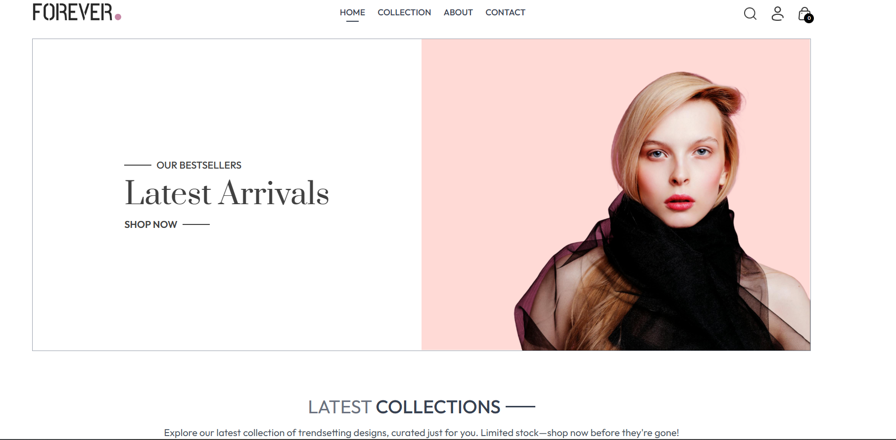
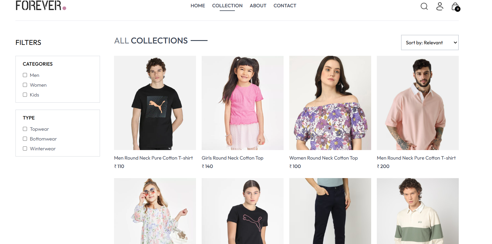
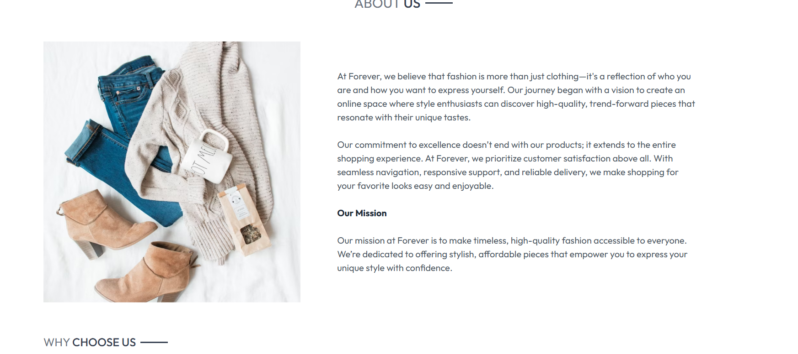
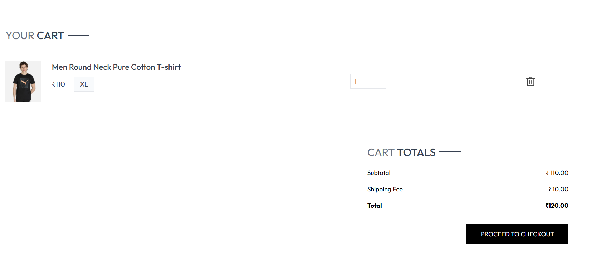
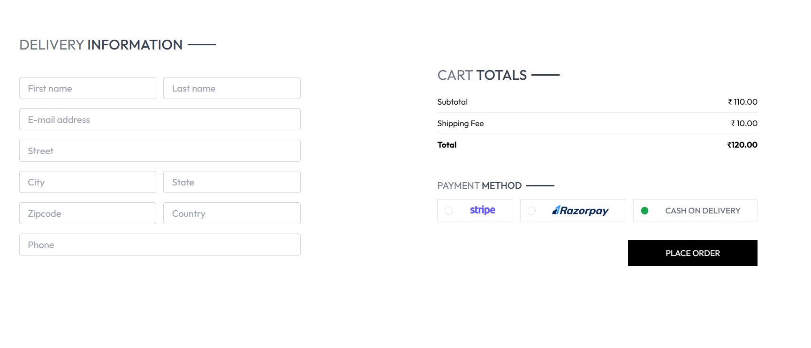

# 🛒 E-Commerce Website with Admin Panel  

An **E-Commerce Web Application** built using the **MERN stack (MongoDB, Express.js, React, Node.js)**.  
This project has **three modules**:  

1. **Backend (Node.js + Express + MongoDB)** – RESTful API  
2. **Frontend (React)** – User-facing website  
3. **Admin Panel (React with Vite)** – Admin dashboard to manage products, orders & users  

---

## 🚀 Features  

### 👤 User Features  
- User registration & login with JWT authentication  
- Browse products with search & filtering  
- Add to cart / Remove from cart  
- Secure checkout & order placement  
- Order history & order tracking  

### 🛠️ Admin Features  
- Admin login with secure authentication  
- Dashboard to manage products, users, and orders  
- Add / Edit / Delete products  
- Upload product images  
- Update order status  
- Manage stock & inventory  

---

## 🖥️ Tech Stack  

### Frontend (User Website)  
- **React.js** – component-based UI  
- **React Router** – navigation  
- **Context API / Redux** – state management  
- **Axios** – API communication  
- **Tailwind CSS / Bootstrap** – styling  

### Admin Panel  
- **React.js (Vite)** – admin dashboard  
- **React Router** – multi-page admin routes  
- **Axios** – API requests  
- **Tailwind CSS / Bootstrap** – responsive UI  

### Backend  
- **Node.js** – JavaScript runtime  
- **Express.js** – REST API  
- **JWT** – authentication & authorization  
- **Bcrypt.js** – password hashing  
- **Multer** – file uploads (images)  

### Database  
- **MongoDB** – NoSQL database  
- **Mongoose** – ODM  

---

## ⚙️ Installation & Setup  

### Prerequisites  
- Node.js & npm  
- MongoDB (local or MongoDB Atlas)  

### Steps  

1. Clone the repository  
   ```bash
   git clone https://github.com/your-username/ecommerce-app.git
   cd ecommerce-app

---
### 2. Install dependencies for backend
         cd backend
         npm install
 ---
 
### 3. Install dependencies for frontend
     cd ../frontend
     npm install
 ---
### 4. Configure environment variables
   Create a `.env` file in the **backend** folder:
                                       MONGO_URI=your_mongodb_connection_string
                                        JWT_SECRET=your_secret_key
                                        PORT=5000
                                        
---
### 5. Run backend server
       cd backend
       npm start
---
### 6. Run frontend (in another terminal)
          cd frontend
           npm start
---
### 7.Admin Panel Setup
              cd admin
              npm install
              npm run dev
---
### 8. 🌐 Run the Project
  -   Backend API → `http://localhost:5000`
    
-   User Website → `http://localhost:3000`
    
-   Admin Panel → `http://localhost:5173`

---
## 📂 Project Structure
  
ecommerce-app/
│── backend/                # Node.js + Express backend
│   ├── config/             # DB config
│   ├── controllers/        # Route controllers
│   ├── middleware/         # Auth middleware
│   ├── models/             # Mongoose schemas
│   ├── routes/             # API routes
│   ├── uploads/            # Product images
│   ├── server.js           # Backend entry point
│   └── .env
│
│── frontend/               # User-facing React app
│   ├── public/
│   ├── src/
│   │   ├── assets/
│   │   ├── components/
│   │   ├── context/
│   │   ├── pages/
│   │   ├── App.jsx
│   │   ├── main.jsx
│   │   └── index.css
│   ├── package.json
│   └── index.html
│
│── admin/                  # Admin panel React app (Vite)
│   ├── public/
│   ├── src/
│   │   ├── assets/
│   │   ├── components/
│   │   ├── pages/
│   │   ├── App.jsx
│   │   ├── main.jsx
│   │   └── index.css
│   ├── vite.config.js
│   ├── package.json
│   └── index.html
│
└── README.md


---
## 📸 Screenshots
 🎬Demo
### 🏠 Home Page
   
   
---
### 🎬 Collection 
  

---
### 🎬 pages
  

---
### 🎬 About 
  

---
### 🎬 Cart 
  

---
### 🎬 Payment
  

---
## 🌟 Future Enhancements
   -   Payment Gateway Integration (Stripe, PayPal, Razorpay)
    
-   Wishlist & Favorites feature
    
-   Product ratings & reviews
    
-   Email/SMS notifications
    
-   Deployment on Vercel / Netlify (Frontend) + Heroku / AWS (Backend)
